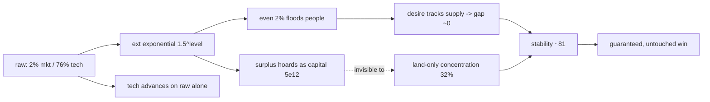

# 04 — Goods-Driven Tech Inequality

## Overview

"Close the heavy-tech/low-good exploit by making the SHARE of created wealth that reaches people the decisive variable: a tech-scaled rising standard of living (aspiration), a provision ratio + capital-aware inequality (top1/top10/bottom20 + divergence) feeding Social Stability, goods-gated research, and a re-based insurrection trigger."

## Todos

- [ ] Add tech-scaled, ratcheting aspiration (separate from subsistence) in `sim/economy.ts` `updateDesire` + config constants
- [ ] Compute provisionRatio `P = consumed / aspiration` per market; store on `Market` + `YearLog`
- [ ] Add capital-hoard divergence + top1/top10/bottom20 spatial shares in `world/state.ts`
- [ ] Throttle research output by provision ratio in `sim/economy.ts` `produce()`
- [ ] Add consumptionGap + divergence penalties to `sim/stability.ts` `computeStability`
- [ ] Re-base insurrection trigger in `sim/tick.ts` onto the capital-aware inequality metric
- [ ] Surface new fields via snapshot/sidebar/charts; serialize/deserialize back-compat; worker `SET_POLICY`
- [ ] Redesign `balance.test.ts` (aggressive scenario encodes the exploit), add unit tests, retune, keep typecheck/test/build green, update `HELP_SECTIONS`

## Detailed Analysis And Proposal

ANALYSIS + PROPOSAL only (no code changed). Every proposed mechanic is pure/deterministic (no `Math.random`), so the determinism and per-year batch-equivalence invariants in `tests/sim.test.ts` hold. All mechanics apply symmetrically to AI markets.

### 1. What the debug run proves

`synthetic-markets-debug-y8840.json` is a flat, deterministic dominance held for ~8800 years on policy `rawToMarketFrac = 0.02`, `rawToTechFrac = 0.76`, `rawToReserveFrac = 0.22`:

- `socialStability ≈ 81`, `wealthConcentration ≈ 32%`, `laborEfficiency ≈ 1.0`, `marketCoverage = 1`.
- `capitalWealth ≈ 5.1e12` and rising ~2.5e9/yr; population steady ~92k.

The mechanics that make this free (verified in code):

- Exponential extraction. `ext(level) = 1.5^level`; `ext(42) ≈ 2.46e7` (`src/sim/tech.ts`). So 2% of mined raw still yields `202 × 2.46e7 ≈ 5.0e9` goods for 92k people. The allocation fraction is swamped by the multiplier.
- Desire tracks supply, so the gap is always ~0. `updateDesire` eases `desireToConsume` toward `DESIRE_SUPPLY_FRAC × goodsProducedThisCycle / pop` (`src/sim/economy.ts`). With `DESIRE_SUPPLY_FRAC = 0.5`, `consumed = 0.5 × flow`, the other half hoards into `capitalWealth` - which is exactly why capital reaches `5.1e12`.
- Consumption draws from the whole hoard. `goodsConsumptionAndDeaths` sets `available = m.capitalWealth`, so any accumulated pile feeds everyone; distribution is irrelevant.
- Inequality is blind to wealth. `wealthConcentration` (`src/world/state.ts`) ranks cells only by land `rawYield + rawStock` per capita; it never reads `capitalWealth`. Hoarding `5.1e12` reads `32%` because the land is evenly populated. Insurrection (`src/sim/tick.ts`) keys off this `32%` vs a `75%` threshold, so it never fires.
- Tech is fed by raw directly. `produce()` does `m.techProgress += mined × rawToTechFrac`, with zero dependence on whether goods reach people.

### 2. Design principle

Make the decisive variable the SHARE of created wealth that reaches people, measured against a standard of living that RISES with the economy. Because aspiration is tech-scaled, the `ext` exponential cancels in the ratio and the policy fraction becomes what matters. Two complementary failure modes both punish stability, creating a genuine Polanyi "double movement" sweet spot:

- UNDER-provision (the exploit): little to market, lots to tech -> consumption gap -> unrest.
- OVER-accumulation: far more to market than people aspire to -> hoard concentrates -> inequality -> unrest.

Optimal play becomes "match goods flow to the rising aspiration while still funding tech/reserves from finite raw" - an ongoing, non-trivial 3-way tension instead of a set-and-forget exploit.

### 3. Proposed mechanics (formulas, files, constants)

#### Mechanic A - Tech-scaled, ratcheting aspiration (separate from subsistence)

File: `src/sim/economy.ts` (`updateDesire` -> add aspiration), `src/config.ts`, `src/world/state.ts` (`Market`/`YearLog`).

Keep the existing `desireToConsume` as a low subsistence level that drives goods-death (people don't die for lack of luxuries). Add a separate, rising aspiration that drives Social Stability only:

- `aspirationTarget = ASPIRATION_FRAC × (rawMinedThisYear × ext(level)) / pop` - i.e. a fraction of the per-capita goods the economy would yield if all mined raw became goods. `ext` is shared with `flow`, so it cancels in the provision ratio below.
- Ratchet (downward-sticky, "not OK consuming less"):
  - if `target > aspiration`: `aspiration += ASPIRATION_RISE_K × (target − aspiration)`
  - else: `aspiration = max(target, aspiration × (1 − ASPIRATION_FALL_K))`

New config (proposed): `ASPIRATION_FRAC = 0.5`, `ASPIRATION_RISE_K = 0.1`, `ASPIRATION_FALL_K = 0.01`.
New `Market` field `aspirationPerCapita` (persisted; back-compat default `0`).

#### Mechanic B - Consumption is flow-limited; surplus = elite hoard

File: `src/sim/economy.ts` (`goodsConsumptionAndDeaths`).

Change `available = m.capitalWealth` to flow-based: `available = m.goodsProducedThisCycle + CAPITAL_TRICKLE_FRAC × m.capitalWealth` (propose `CAPITAL_TRICKLE_FRAC = 0`, exposed as a knob). Surplus flow still accrues to `capitalWealth` (now interpreted as the undistributed hoard). This is what makes a low market allocation actually fail to reach people, and a high one pile up.

#### Mechanic C - Provision ratio + capital-aware inequality (literal top1/bottom20)

Files: `src/world/state.ts`, `src/sim/stability.ts`.

Decision: the top1%/bottom20% population shares are the literal inequality driver of stability (not just display). Generalize `wealthConcentration` into one capital-aware pass that returns per-capita wealth for population quantiles and their shares:

- Per-cell wealth is capital-aware: `cellWealth = land[c] + capitalWealth × eliteWeight(c)`, where `eliteWeight` concentrates the hoard onto the wealthiest cells (a deliberate elite-capture assumption: the undistributed hoard is held disproportionately by the rich, so a flat-vs-land distribution would otherwise be invisible). Concretely attribute the hoard across cells proportional to `land[c]^HOARD_CAPTURE_EXP` (propose `HOARD_CAPTURE_EXP = 2`) so capital concentrates more than land and actually moves the shares.
- Compute `top1Share` (`WEALTH_TOP1_FRACTION = 0.01`), `top10Share` (`WEALTH_TOP_FRACTION = 0.10`), and `bottom20Share` (`WEALTH_BOTTOM_FRACTION = 0.20`) as percent of total wealth.
- Literal divergence index used by stability: `divergence = (top1PerCapita) / max(bottom20PerCapita, epsilon)` (per-capita wealth of the top 1% over the bottom 20%).
- Retain the capital-hoard ratio `(capitalWealth/pop)/max(consumedPerCapita, epsilon)` as a reported diagnostic.
- Provision ratio: `P = clamp(consumedPerCapita / max(aspirationPerCapita, epsilon), 0, 1)`. With A+B, `P ≈ min(1, rawToMarketFrac × marketCoverage / ASPIRATION_FRAC)` (`ext` cancels). At `ASPIRATION_FRAC = 0.5`: rawToMarket `0.02` -> `P≈0.04`; `0.25` -> `0.5`; `0.5` -> `1.0`.

New config: `WEALTH_TOP1_FRACTION = 0.01`, `WEALTH_BOTTOM_FRACTION = 0.2`, `HOARD_CAPTURE_EXP = 2`, `CAPITAL_TRICKLE_FRAC = 0`.
New `Market` fields: `provisionRatio`, `wealthDivergence`, `top1Share`, `top10Share`, `bottom20Share` (persisted, back-compat defaults).

#### Mechanic D - Goods drive tech (hard provision gate)

File: `src/sim/economy.ts` (`produce`).

Decision: hard gate - at very low provision, research effectively stops. Scale realized research: `m.techProgress += toTech × techProvisionFactor(P)` with a convex, near-zero low end: `TECH_PROVISION_ANCHORS = [[0,0.0],[0.1,0.0],[0.25,0.1],[0.5,0.5],[0.75,0.85],[1,1]]` (so `P` below ~0.1 yields ~no tech). Pouring raw into tech while starving goods now advances tech almost not at all - directly inverting the exploit. This uses the previous cycle's `P`, carried like `laborEfficiency`, to avoid an intra-cycle ordering dependency.

#### Mechanic E - Wire into Social Stability

File: `src/sim/stability.ts` (`computeStability`), `src/config.ts`.

`stability = 100 − wealthPenalty − foodStressPenalty − disruptionPenalty − consumptionGapPenalty(P) − divergencePenalty(divergence)` (clamp 0..100).

- `STABILITY_CONSUMPTION_GAP_ANCHORS` over `P`: `[[1,0],[0.9,5],[0.75,15],[0.5,35],[0.25,55],[0,75]]`.
- `STABILITY_DIVERGENCE_ANCHORS` over `log10(divergence)` where `divergence = top1PerCapita / bottom20PerCapita`: `[[0,0],[1,5],[2,20],[3,45],[4,70]]`.

These flow through the existing coupling unchanged: stability -> `laborEfficiencyOf` -> effective labor (food/raw/research) and `marketCoverageOf` -> goods capture. So a collapsing-stability market also loses output and tech - a real downward spiral the player must avoid by feeding people.

#### Mechanic F - Re-base insurrection

File: `src/sim/tick.ts`.

Drive the warning/insurrection logic off the new capital-aware `top10Share` (the same generalized metric, so the hoard now concentrates it) instead of the land-only `wealthConcentration`, so the hoarding/tech-only strategy actually crosses the `75%` threshold and risks collapse. Keep the existing RNG salt (`RNG_SALT.INSURRECTION`) and probability ramp.

### 4. Why this fixes the exploit (worked numbers)

For the debug policy (`rawToMarketFrac = 0.02`) after A-E, at `ASPIRATION_FRAC = 0.5`:

- `P ≈ 0.04` -> consumptionGapPenalty ≈ 73 -> stability floors near 0 -> `laborEfficiency -> 0.25` (output collapses) and tech throttle -> 0.1 (advancement nearly stops).
- Insurrection now fires on the rebased metric.

For default play (`rawToMarketFrac = 0.6`): `P = min(1, 0.6/0.5) = 1` -> no gap penalty; `divergence` low (flow ≈ aspiration, little hoard) -> default play essentially unaffected. The winning band is roughly `rawToMarketFrac ≈ ASPIRATION_FRAC` while funding tech/reserve from the rest.

### 5. State, serialization, snapshot, UI

- `Market` (lines 33-85 of `src/world/state.ts`): add `aspirationPerCapita`, `provisionRatio`, `wealthDivergence`, `top1Share`, `bottom20Share`. Initialize in `makeMarket` (~line 344) and add `?? default` fallbacks in `deserialize` (lines 660-698). `serialize` needs no change (spreads `...m`).
- `YearLog` (lines 87-102): add `provisionRatio`, `wealthDivergence`, `top1Share`, `bottom20Share`; populate in the `state.log.push` in `src/sim/tick.ts` (lines 260-273).
- `MarketSummary` + `buildSnapshot` (`src/render/snapshot.ts`): expose the new fields; debug-log download (in `src/main.ts`) picks them up via the summary.
- UI: add the provision ratio / divergence / top1 / bottom20 to the sidebar stats and a history mini-chart (`src/ui/sidebar.ts`, `src/ui/charts.ts`, `src/ui/stats.ts`). Update `HELP_SECTIONS` in `src/main.ts` (required by `AGENTS.md` when player-facing mechanics change).

### 6. Test impact (important)

- `tests/balance.test.ts` encodes the exploit: the "aggressive" scenario uses `rawToMarketFrac: 0.0, rawToTechFrac: 0.95` and asserts `aggressive.techLevel > casual.techLevel`. With Mechanic D this strategy throttles its own tech. This test must be redesigned: the new "research lever" scenario should be a balanced policy (e.g. market `0.5` / tech `0.4` / reserve `0.1`) that out-techs casual, plus a new assertion that an under-provisioned (`rawToMarket≈0`) policy ends with low `socialStability` / high `wealthDivergence` and does not dominate.
- `tests/sim.test.ts` (determinism, batch-equivalence, invariants): mechanics are deterministic, so structural invariants hold; update any hard-coded numeric expectations that move.
- Add focused unit tests: aspiration ratchet (rises, sticky down), `P` formula, `divergence`, the two new stability penalties, and the tech-provision throttle.
- Keep `npm run typecheck && npm test && npm run build` green; commit with the no-attribution author per `AGENTS.md`.

### 7. Risks

- Mechanic B (flow-limited consumption) is the highest-impact behavioral change; it shifts the whole economy and will need retuning of `ASPIRATION_FRAC` and the anchor tables so default/opening play stays survivable (the seed-panel test in `balance.test.ts` guards this).
- Symmetric application means AI markets also feel it - generally good (more realistic rivals, real competition), but watch for mass AI collapse changing map dynamics.

### 8. Decisions (confirmed)

- Tech gating: hard gate - `TECH_PROVISION_ANCHORS` near-zero below `P≈0.1` (Mechanic D).
- Inequality in stability: literal top1%-vs-bottom20% per-capita divergence drives the penalty (Mechanic C/E); capital-aware shares via `HOARD_CAPTURE_EXP`.
- Scope: full A-F in one pass, with retuning.
- `CAPITAL_TRICKLE_FRAC = 0` (strictly flow-limited consumption) for the first pass.

Remaining as tuning (not blockers): exact anchor values / target difficulty, settled empirically against the balance + seed-panel tests.
